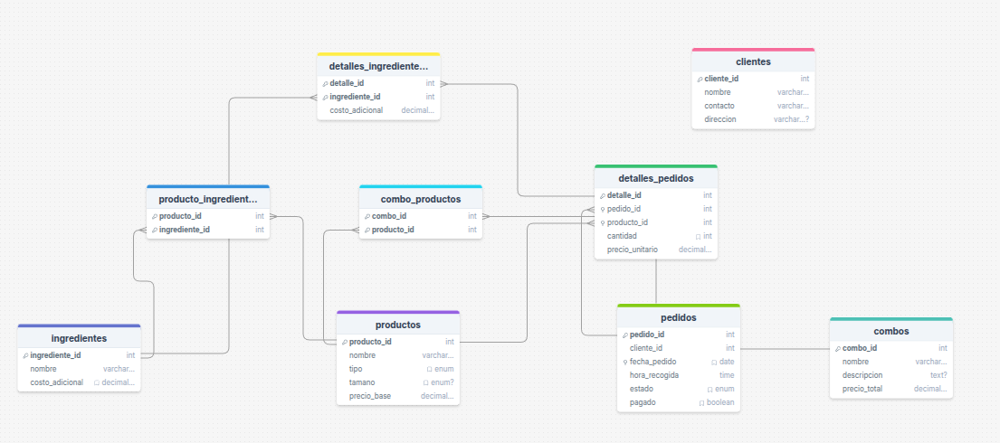

# 🍕 Pizza Fiesta - Sistema de Gestión de Pedidos y Productos

## Descripción General

**Pizza Fiesta** es una pizzería que busca optimizar sus operaciones diarias mediante un sistema de gestión de base de datos que le permita llevar el control de clientes, productos (pizzas, bebidas, ingredientes), pedidos, pagos y personalización de órdenes. Este proyecto implementa un modelo lógico y físico en MySQL para dar soporte completo a estos procesos.

---

## 📁 Contenido del Proyecto

* `estructura.sql`: Archivo con la definición completa de la base de datos (tablas, relaciones, claves primarias y foráneas).
* `datos.sql`: Archivo con la inserción de datos de prueba para validar el funcionamiento del sistema.
* `diagramas/`: Carpeta con capturas o enlaces de los modelos lógico y físico.
* `README.md`: Este archivo con descripción, instrucciones y consultas SQL.

---

## 🏗️ Instrucciones para la Ejecución

### Requisitos

* MySQL Server 8.0+
* Cliente MySQL (CLI, Workbench u otro)

### Pasos

1. Crear una base de datos vacía:

   ```sql
   CREATE DATABASE pizzafiesta;
   USE pizzafiesta;
   ```

2. Ejecutar el archivo de estructura:

   ```sql
   SOURCE estructura.sql;
   ```

3. Ejecutar el archivo de datos:

   ```sql
   SOURCE datos.sql;
   ```

---

## 🧩️ Estructura de la Base de Datos

### Entidades Principales

* **Clientes**: Registro de nombre, contacto y dirección.
* **Productos**:

  * Pizzas (con diferentes tamaños)
  * Bebidas
  * Ingredientes
* **Pedidos**:

  * Control de estado (pagado, preparado)
  * Hora de recogida
  * Relación con cliente y productos
* **Pedidos\_Pizzas**: Asocia pizzas por pedido, con detalles como tamaño, ingredientes extra, precio final.
* **Ingredientes\_Pizza**: Define los ingredientes base de cada pizza y permite personalización.

---
## PRUEBA DEL DIAGRAMA 
